# Knowledge Graph — hizli-okuma

Generated by `/graphify`. Scope: project root (`src/`, `content/`, `docs/`, root configs, `.agents/`, `graphify-out/`).
Entities and relationships are grounded in the codebase files.

## Diagram

```mermaid
graph TD
  subgraph ArchitectureDocs["Architecture & Project Docs"]
    AGENTS["AGENTS.md"]
    CLAUDE["CLAUDE.md"]
    STATUS["PROJECT_STATUS.md"]
    RELEASE["RELEASE_TODO.md"]
    AUDIT["PRODUCTION_AUDIT.md"]
    CHECKLIST["PRODUCTION_CHECKLIST.md"]
    BUGS["BUGS.md"]
    BACKLOG["FEATURE_BACKLOG.md"]
  end

  subgraph AgentTooling["Agent Tools & Rules"]
    ARULE[".agents/rules/hizli-okuma.md"]
    AGRAPH[".agents/rules/graphify.md"]
    ARTK[".agents/rules/antigravity-rtk-rules.md"]
    AHOOK[".agents/hooks.json"]
    ASCRIPTS[".agents/scripts/check_graphify.py"]
    AWFLOW[".agents/workflows/graphify.md"]
    GOUT["graphify-out/ (graph.json, GRAPH_REPORT.md, graph.html)"]
  end

  subgraph AppShell["Expo Router App Shell (src/app)"]
    ROOT_LAYOUT["src/app/_layout.tsx (Root Providers & Theme)"]
    PAYWALL_ROUTE["src/app/paywall.tsx (Modal Paywall)"]
    ONBOARDING_GROUP["src/app/(onboarding)/ (Onboarding Flow)"]
    APP_GROUP["src/app/(app)/_layout.tsx"]
    TAB_LAYOUT["src/app/(app)/(tabs)/_layout.tsx"]
    HOME_TAB["src/app/(app)/(tabs)/index.tsx (Home / Daily Goal)"]
    EXERCISES_TAB["src/app/(app)/(tabs)/exercises.tsx (Exercise Catalog)"]
    STATS_TAB["src/app/(app)/(tabs)/statistics.tsx (Progress & Charts)"]
    SETTINGS_TAB["src/app/(app)/(tabs)/settings.tsx (Preferences & Subscription)"]
    DAILY_PLAN_ROUTE["src/app/(app)/daily-plan.tsx"]
    WEEKLY_SUMMARY_ROUTE["src/app/(app)/weekly-summary.tsx"]
    EXERCISE_DYNAMIC["src/app/(app)/exercise/[id].tsx (Exercise Runner)"]
  end

  subgraph ExerciseDomain["Exercise Domain & Engines (src/features/exercises)"]
    EX_REGISTRY["src/features/exercises/registry.ts (ExerciseRegistry)"]
    EX_CONTENT["src/features/exercises/content.ts (Built-in Reading Texts)"]
    EX_SELECT["src/features/exercises/contentSelection.ts"]
    EX_BASE["src/features/exercises/engine/useExerciseEngine.ts"]
    EX_TYPES["src/features/exercises/types.ts"]

    EX_RSVP["rsvp (RSVP / Spritz Engine & Screen)"]
    EX_SCHULTE["schulte (Schulte Grid Engine & Screen)"]
    EX_PACER["pacer (Visual Pacer Engine & Screen)"]
    EX_PERIPHERAL["peripheral (Peripheral Expansion Engine & Screen)"]
    EX_SCANNING["scanning (Word/Symbol Scanning Engine & Screen)"]
    EX_CHUNKING["chunking (Text Chunking Engine & Screen)"]
    EX_MEMORY["memory (Visual Memory Engine & Screen)"]
    EX_SENTENCE["sentence-memory (Sentence Memory Engine & Screen)"]
    EX_COMP["comprehension-speed (Speed Comprehension Engine & Screen)"]
    EX_KEYWORD["keyword (Keyword Identification Engine & Screen)"]
    EX_MAIN_IDEA["main-idea (Main Idea Extraction Engine & Screen)"]
    EX_NUM_SCAN["number-scan (Number Scan Engine & Screen)"]
    EX_ATTENTION["selective-attention (Selective Attention Engine & Screen)"]
    EX_WORD_REC["word-recognition (Word Recognition Engine & Screen)"]
  end

  subgraph Features["Domain Features (src/features)"]
    FEAT_COMP["src/features/comprehension/ (Questions & Scoring)"]
    FEAT_PLAN["src/features/dailyPlan/ (Daily Plan Generator & Flow)"]
    FEAT_ONBOARD["src/features/onboarding/ (Questionnaire & Assessment)"]
    FEAT_STREAK["src/features/streak/ (Streak Counter & Rewards)"]
    FEAT_SUB["src/features/subscription/ (RevenueCat Paywall & Status)"]
    FEAT_WEEKLY["src/features/weeklySummary/ (Weekly Analytics & Summary)"]
  end

  subgraph StateManagement["Stores & Persistence (src/stores)"]
    STORAGE["src/stores/storage.ts (MMKV Persistence Adapter)"]
    STORE_PROGRESS["src/stores/userProgressStore.ts (WPM, Level, Stats)"]
    STORE_EX_PROG["src/stores/exerciseProgressStore.ts (Exercise Stats & Highscores)"]
    STORE_SETTINGS["src/stores/settingsStore.ts (Theme, Audio, Notifications)"]
    STORE_PLAN["src/stores/dailyPlanStore.ts (Daily Plan Progression)"]
    STORE_HISTORY["src/stores/localHistoryStore.ts (Local Activity History)"]
    STORE_GAMIFY["src/stores/gamificationStore.ts (Badges, XP, Streaks)"]
    STORE_STREAK_CACHE["src/stores/streakCacheStore.ts"]
    STORE_EX_SETTINGS["src/stores/useExerciseSettingsStore.ts"]
    STORE_COMP["src/stores/useComprehensionStore.ts"]
    STORE_PAYWALL_PROMPT["src/stores/paywallPromptStore.ts"]
  end

  subgraph ServicesAndLib["Services, Lib & Infrastructure"]
    SRV_NOTIF["src/services/notifications.ts (expo-notifications scheduler)"]
    LIB_SENTRY["src/lib/sentry.ts (Error Monitoring)"]
    LIB_AMPLITUDE["src/lib/amplitude.ts (Analytics Telemetry)"]
    LIB_REVENUECAT["src/lib/purchases.ts (RevenueCat In-App Purchases)"]
    LIB_I18N["src/i18n/index.ts (i18next Turkish/English setup)"]
    UI_THEME["tamagui.config.ts (Tamagui Theme Tokens)"]
  end

  %% Relationships
  ROOT_LAYOUT --> APP_GROUP
  ROOT_LAYOUT --> ONBOARDING_GROUP
  ROOT_LAYOUT --> PAYWALL_ROUTE
  ROOT_LAYOUT --> LIB_I18N
  ROOT_LAYOUT --> LIB_SENTRY
  ROOT_LAYOUT --> LIB_AMPLITUDE
  ROOT_LAYOUT --> LIB_REVENUECAT

  APP_GROUP --> TAB_LAYOUT
  TAB_LAYOUT --> HOME_TAB
  TAB_LAYOUT --> EXERCISES_TAB
  TAB_LAYOUT --> STATS_TAB
  TAB_LAYOUT --> SETTINGS_TAB

  HOME_TAB --> FEAT_PLAN
  HOME_TAB --> FEAT_STREAK
  EXERCISES_TAB --> EX_REGISTRY
  EXERCISE_DYNAMIC --> EX_REGISTRY
  EX_REGISTRY --> EX_RSVP
  EX_REGISTRY --> EX_SCHULTE
  EX_REGISTRY --> EX_PACER
  EX_REGISTRY --> EX_PERIPHERAL
  EX_REGISTRY --> EX_SCANNING
  EX_REGISTRY --> EX_CHUNKING
  EX_REGISTRY --> EX_MEMORY
  EX_REGISTRY --> EX_SENTENCE
  EX_REGISTRY --> EX_COMP
  EX_REGISTRY --> EX_KEYWORD
  EX_REGISTRY --> EX_MAIN_IDEA
  EX_REGISTRY --> EX_NUM_SCAN
  EX_REGISTRY --> EX_ATTENTION
  EX_REGISTRY --> EX_WORD_REC

  EX_RSVP --> EX_BASE
  EX_SCHULTE --> EX_BASE
  EX_PACER --> EX_BASE
  EX_PERIPHERAL --> EX_BASE
  EX_BASE --> STORE_EX_PROG
  EX_BASE --> STORE_PROGRESS
  EX_BASE --> STORE_GAMIFY

  FEAT_PLAN --> STORE_PLAN
  FEAT_SUB --> LIB_REVENUECAT
  FEAT_SUB --> STORE_PAYWALL_PROMPT
  SETTINGS_TAB --> STORE_SETTINGS
  SETTINGS_TAB --> SRV_NOTIF
  SETTINGS_TAB --> FEAT_SUB

  STORE_PROGRESS --> STORAGE
  STORE_EX_PROG --> STORAGE
  STORE_SETTINGS --> STORAGE
  STORE_PLAN --> STORAGE
  STORE_HISTORY --> STORAGE
  STORE_GAMIFY --> STORAGE
```

## Entity Table

| Entity | Type | Description | Source File |
| :--- | :--- | :--- | :--- |
| `AGENTS.md` | Doc / Rule | Project rules, architecture conventions, constraints & strict tech stack | [`AGENTS.md`](file:///home/emre/Masaüstü/yazilim/hizli-okuma/AGENTS.md) |
| `CLAUDE.md` | Doc / Index | AI assistant quick references and links to other architecture docs | [`CLAUDE.md`](file:///home/emre/Masaüstü/yazilim/hizli-okuma/CLAUDE.md) |
| `PROJECT_STATUS.md` | Doc | Current architecture, feature statuses, roadmap, and dependency audit findings | [`PROJECT_STATUS.md`](file:///home/emre/Masaüstü/yazilim/hizli-okuma/PROJECT_STATUS.md) |
| `BUGS.md` | Doc | Tracks known bugs and UX issues (e.g. daily plan flow, localization) | [`BUGS.md`](file:///home/emre/Masaüstü/yazilim/hizli-okuma/BUGS.md) |
| `RootLayout` | Component / Shell | Root Expo Router layout initializing Tamagui, Sentry, i18n and revenue purchases | [`src/app/_layout.tsx`](file:///home/emre/Masaüstü/yazilim/hizli-okuma/src/app/_layout.tsx) |
| `TabLayout` | Component / Navigation | Main 4-tab bottom bar navigation (Home, Exercises, Statistics, Settings) | [`src/app/(app)/(tabs)/_layout.tsx`](file:///home/emre/Masaüstü/yazilim/hizli-okuma/src/app/(app)/(tabs)/_layout.tsx) |
| `ExerciseRegistry` | Registry / Domain | Central registry and metadata for all 14 speed reading and comprehension exercises | [`src/features/exercises/registry.ts`](file:///home/emre/Masaüstü/yazilim/hizli-okuma/src/features/exercises/registry.ts) |
| `useExerciseEngine` | Hook / Core Engine | Base state machine lifecycle hook for exercises (idle -> prep -> running -> completed) | [`src/features/exercises/engine/useExerciseEngine.ts`](file:///home/emre/Masaüstü/yazilim/hizli-okuma/src/features/exercises/engine/useExerciseEngine.ts) |
| `RSVPEngine` | Feature / Exercise | Rapid Serial Visual Presentation exercise engine for visual cadence and pacing | [`src/features/exercises/rsvp/`](file:///home/emre/Masaüstü/yazilim/hizli-okuma/src/features/exercises/rsvp) |
| `SchulteEngine` | Feature / Exercise | Schulte Table numeric focus and peripheral vision expansion engine | [`src/features/exercises/schulte/`](file:///home/emre/Masaüstü/yazilim/hizli-okuma/src/features/exercises/schulte) |
| `PacerEngine` | Feature / Exercise | Guided reading speed pacer with highlighting blocks | [`src/features/exercises/pacer/`](file:///home/emre/Masaüstü/yazilim/hizli-okuma/src/features/exercises/pacer) |
| `PeripheralEngine` | Feature / Exercise | Dual-target peripheral field expansion exercise | [`src/features/exercises/peripheral/`](file:///home/emre/Masaüstü/yazilim/hizli-okuma/src/features/exercises/peripheral) |
| `DailyPlanFeature` | Feature / Domain | Algorithmic daily exercise routine generator based on user level and stats | [`src/features/dailyPlan/`](file:///home/emre/Masaüstü/yazilim/hizli-okuma/src/features/dailyPlan) |
| `StreakFeature` | Feature / Domain | Consecutive day streak tracking, freeze protection and milestone rewards | [`src/features/streak/`](file:///home/emre/Masaüstü/yazilim/hizli-okuma/src/features/streak) |
| `SubscriptionFeature` | Feature / Monetization | RevenueCat entitlement management, paywall trigger modal and restore flow | [`src/features/subscription/`](file:///home/emre/Masaüstü/yazilim/hizli-okuma/src/features/subscription) |
| `userProgressStore` | Store / Zustand | Global user reading speed (WPM), experience level and assessment scores | [`src/stores/userProgressStore.ts`](file:///home/emre/Masaüstü/yazilim/hizli-okuma/src/stores/userProgressStore.ts) |
| `exerciseProgressStore`| Store / Zustand | High-scores, difficulty levels and completion history per exercise type | [`src/stores/exerciseProgressStore.ts`](file:///home/emre/Masaüstü/yazilim/hizli-okuma/src/stores/exerciseProgressStore.ts) |
| `dailyPlanStore` | Store / Zustand | Current day's active plan items and completion progress | [`src/stores/dailyPlanStore.ts`](file:///home/emre/Masaüstü/yazilim/hizli-okuma/src/stores/dailyPlanStore.ts) |
| `gamificationStore` | Store / Zustand | XP gains, achievement badges and unlockables | [`src/stores/gamificationStore.ts`](file:///home/emre/Masaüstü/yazilim/hizli-okuma/src/stores/gamificationStore.ts) |
| `settingsStore` | Store / Zustand | User preferences (dark/light/system theme, sounds, notifications, language) | [`src/stores/settingsStore.ts`](file:///home/emre/Masaüstü/yazilim/hizli-okuma/src/stores/settingsStore.ts) |
| `storage` | Storage / Adapter | Synchronous MMKV fast local storage adapter for Zustand persistence | [`src/stores/storage.ts`](file:///home/emre/Masaüstü/yazilim/hizli-okuma/src/stores/storage.ts) |
| `notificationsService`| Service / Expo | Daily reminder and streak protection push notifications scheduler | [`src/services/notifications.ts`](file:///home/emre/Masaüstü/yazilim/hizli-okuma/src/services/notifications.ts) |
