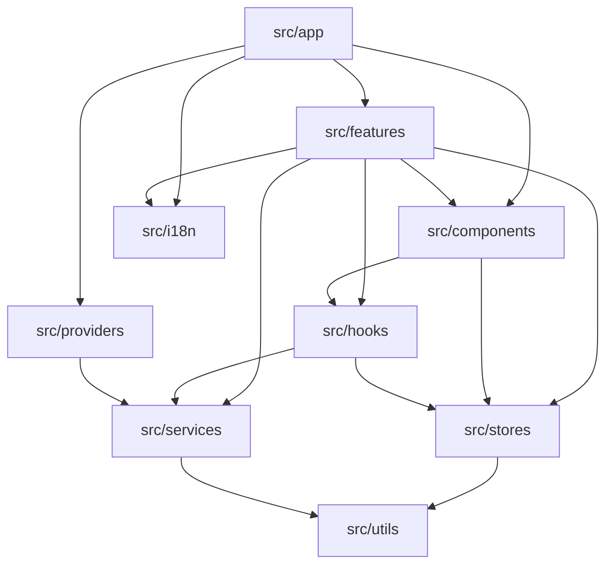

# Knowledge Graph: hizli-okuma

## Entities

| Entity | Type | Description | Source |
|---|---|---|---|
| src/app | Code | Expo Router routes and entry points | `src/app` |
| src/components | Code | Reusable UI components (Tamagui, etc.) | `src/components` |
| src/features | Code | Domain-specific features and exercise engine | `src/features` |
| src/hooks | Code | Custom React hooks | `src/hooks` |
| src/stores | Code | Zustand + MMKV local state stores | `src/stores` |
| src/services | Code | External services (RevenueCat, Sentry, Amplitude) | `src/services` |
| src/providers | Code | Global context providers | `src/providers` |
| src/utils | Code | Helper utilities | `src/utils` |
| src/i18n | Code | i18next configuration and translations | `src/i18n` |

> Note: The full AST-level knowledge graph (6,500+ nodes) is maintained in `graphify-out/` via the `graphify update .` CLI. This `.graphify/graph.md` represents the high-level domain structure of the target (`.`).
