# Knowledge Graph: hizli-okuma

```mermaid
graph TD
    App[src/app] --> Features[src/features]
    App --> Components[src/components]
    App --> Providers[src/providers]
    
    Features --> Components
    Features --> Stores[src/stores]
    Features --> Services[src/services]
    Features --> Hooks[src/hooks]
    
    Features --> OnboardingScreen[src/features/onboarding/OnboardingScreen.tsx]
    Features --> PaywallScreen[src/features/subscription/PaywallScreen.tsx]
    Features --> ComprehensionScreen[src/features/comprehension/ComprehensionScreen.tsx]
    Features --> PricingTests[src/features/subscription/__tests__/pricing.test.ts]
    
    Components --> Stores
    Components --> Hooks
    
    Hooks --> Stores
    Hooks --> Services
    
    Providers --> Services
    
    Stores --> Utils[src/utils]
    Services --> Utils
    
    App --> I18n[src/i18n]
    Features --> I18n
    
    Components --> AppCard[src/components/ui/AppCard.tsx]
    Components --> StatisticsDashboard[src/components/ui/StatisticsDashboard.tsx]
    Components --> Track[src/components/ui/track/Track.tsx]
    Components --> AchievementPopup[src/components/gamification/AchievementPopup.tsx]
    
    Docs[Documentation] --> REVIEW_FOR_CLAUDE[REVIEW_FOR_CLAUDE.md]
    Docs --> PROJECT_STATUS[PROJECT_STATUS.md]
    Docs --> RELEASE_TODO[RELEASE_TODO.md]
    Docs --> DESIGN[DESIGN.md]
    Docs --> BUGS[BUGS.md]
    Docs --> PRODUCT[PRODUCT.md]
    Docs --> FEATURE_BACKLOG[FEATURE_BACKLOG.md]
    
    Config[Configuration] --> ExpoEnv[expo-env.d.ts]
    Config --> PackageJson[package.json]
    Config --> AppJson[app.json]
```

## Entities

| Entity | Type | Description | Source |
|---|---|---|---|
| src/app | Code | Expo Router routes and entry points | `src/app` |
| src/components | Code | Reusable UI components (Tamagui, etc.) | `src/components` |
| src/features | Code | Domain-specific features and exercise engine | `src/features` |
| src/features/onboarding/OnboardingScreen.tsx | Code | Onboarding assessment and speed test flow | `src/features/onboarding/OnboardingScreen.tsx` |
| src/features/subscription/PaywallScreen.tsx | Code | Custom paywall and subscription offering UI | `src/features/subscription/PaywallScreen.tsx` |
| src/features/comprehension/ComprehensionScreen.tsx | Code | Reading comprehension assessment test and actions | `src/features/comprehension/ComprehensionScreen.tsx` |
| src/features/subscription/__tests__/pricing.test.ts | Code | Unit tests for package sorting and annual saving percent | `src/features/subscription/__tests__/pricing.test.ts` |
| src/hooks | Code | Custom React hooks | `src/hooks` |
| src/stores | Code | Zustand + MMKV local state stores | `src/stores` |
| src/services | Code | External services (RevenueCat, Sentry, Amplitude) | `src/services` |
| src/providers | Code | Global context providers | `src/providers` |
| src/utils | Code | Helper utilities | `src/utils` |
| src/i18n | Code | i18next configuration and translations | `src/i18n` |
| src/components/ui/AppCard.tsx | Code | Reusable card UI component | `src/components/ui/AppCard.tsx` |
| src/components/ui/StatisticsDashboard.tsx | Code | Dashboard for reading statistics | `src/components/ui/StatisticsDashboard.tsx` |
| src/components/ui/track/Track.tsx | Code | Track UI component | `src/components/ui/track/Track.tsx` |
| src/components/gamification/AchievementPopup.tsx | Code | Achievement notification popup | `src/components/gamification/AchievementPopup.tsx` |
| REVIEW_FOR_CLAUDE.md | Doc | Comprehensive audit, root causes, fixes and verification guide | `REVIEW_FOR_CLAUDE.md` |
| PROJECT_STATUS.md | Doc | Current architecture and implementation status | `PROJECT_STATUS.md` |
| RELEASE_TODO.md | Doc | Remaining release checklist and store deployment steps | `RELEASE_TODO.md` |
| DESIGN.md | Doc | Design specifications and UI/UX plans | `DESIGN.md` |
| BUGS.md | Doc | Known bugs and issues | `BUGS.md` |
| PRODUCT.md | Doc | Product requirements and goals | `PRODUCT.md` |
| FEATURE_BACKLOG.md | Doc | Backlog of planned features | `FEATURE_BACKLOG.md` |
| expo-env.d.ts | Config | TypeScript types for Expo environment | `expo-env.d.ts` |
| package.json | Config | NPM dependencies and scripts | `package.json` |
| app.json | Config | Expo configuration | `app.json` |
| test-setup.ts | Config | Jest test setup | `test-setup.ts` |

> Note: The full AST-level knowledge graph (6,700+ nodes) is maintained in `graphify-out/` via the `graphify update .` CLI. This `.graphify/graph.md` represents the high-level domain structure of the target (`.`).

<!-- Updated incrementally by agent for changed files -->
